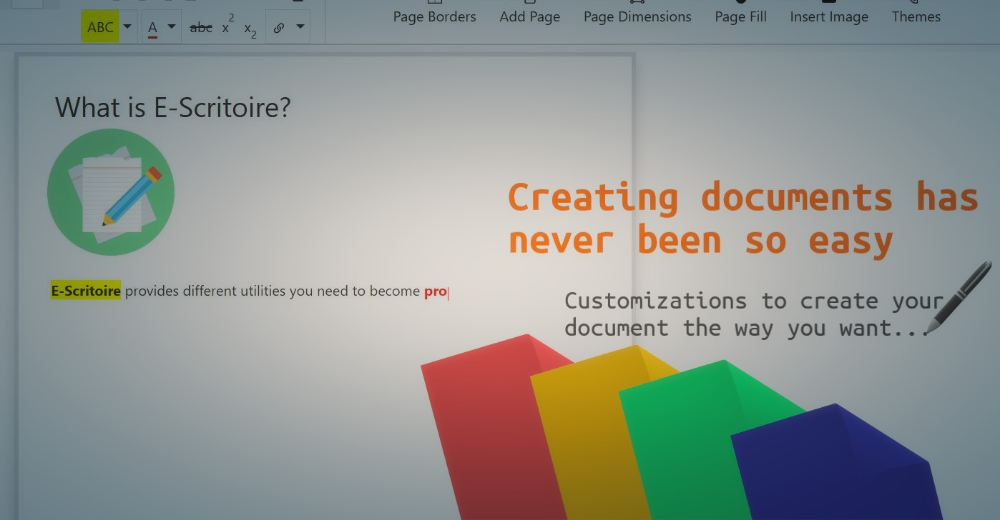
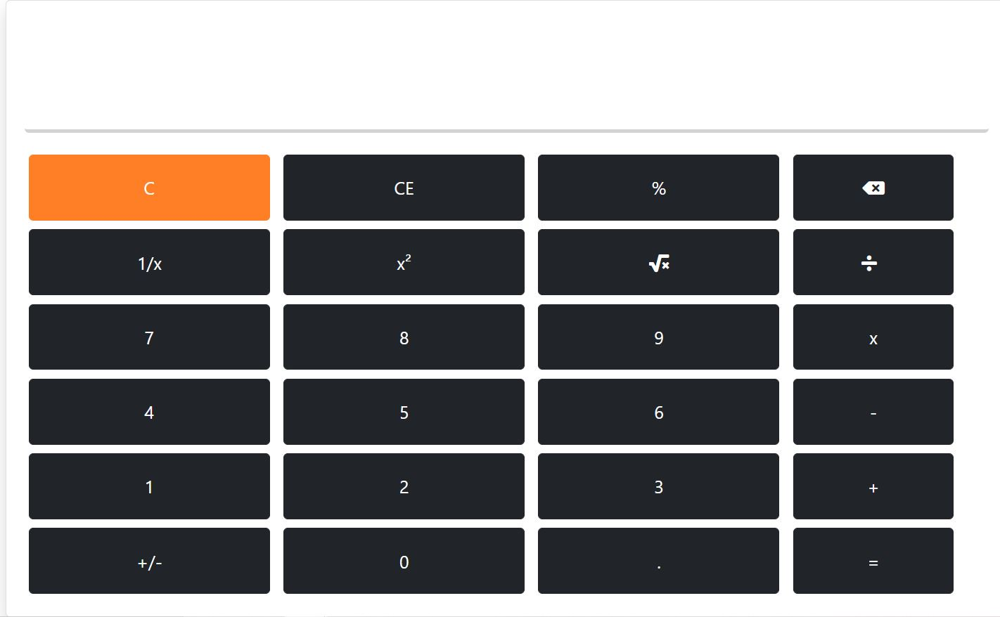

# E-Scritoire
---
Escritoire means a small writing desk. E-Scritoire, as the slight modification in the name suggets, is like an online desk for you, to increase your productivity. It provides some basic tools(or utilities) to enhance your productivity.

Some of the E-Scritoire's services include:
- Clock and Stopwatch
- Text Editor
- Calculator
  
---
### Text Editor
With a wide range of customisation options, our text editor is certainly the major utility. Just like high profile document editors like MSWord or Google Docs, this text editor is like a lightweighted mini version of those editors.

By offering a variety of colors, template designs and every kind of customisation that one wants, you can make your document your own!

  

---
### Calculator
With our calculator, you can perform simple calculations while physically just one click. Switch between the different utilities with just a click of a button. Fast calculations and keyboard inputs too will save you a lot of time.

  

---
### Clock & Stopwatch
With a real time dynamic clock and a stopwatch that runs in the background even if you switch pages **_within the website_**. Start, Pause and Reset it the way you want. 

---
🔗 Visit <a href="https://naikshrey2308.github.io/WDW_Project_CE062_CE064_CE070/">E-Scritoire</a>

Website made by:
- <a href="https://www.github.com/naikshrey2308">Shrey Naik</a>
- <a href="https://www.github.com/Manav-Mistry">Manav Mistry</a>
- <a href="https://www.github.com/parikhvedant2003">Vedant Parikh</a>
